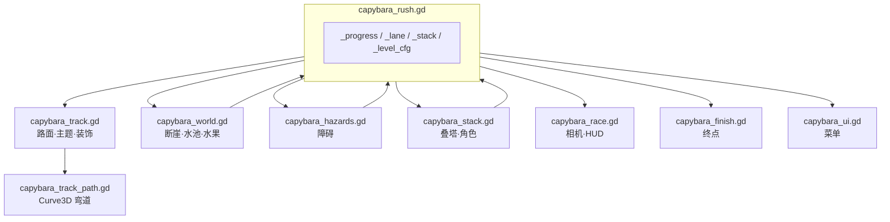

# Capybara Rush 代码架构说明

> 路径：`assets/maps/route_levels/capybara_rush/`  
> 入口场景：`capybara_rush.tscn` → 根脚本 `capybara_rush.gd`（**Host / 编排器**）  
> 运行：在 Godot 中打开场景后按 **F6** 运行当前场景。

---

## 1. 这是什么游戏？

**Capybara Rush** 是一款 **3 车道自动前进 + 左右换道** 的跑酷原型，核心模式是 **Stack（叠塔）**：

- 沿弯道赛道向前跑（`_progress` 增大）
- 左/右切换三条车道（`_lane` / `_lane_x`）
- 空格跳跃；吃到水果/拾取物会 **叠一层同款角色**
- 撞障碍按障碍高度 **掉层**；叠得越高越有优势也有风险
- 终点有台阶 ceremony（吃瓜/齐舞）

另有 **Race（竞速冲锋）** 子模式：碰飞船进入冲锋，逻辑在 `capybara_race.gd`。

---

## 2. 总体架构（Host 模式）

2024 年后主脚本 `capybara_rush.gd` 从单体 ~3000 行拆成 **「Host + 子系统 RefCounted」**：

```
capybara_rush.gd (Host, Node3D)
├── _track_sys    → CapybaraTrack      赛道、环境、主题、路面
├── _world_sys    → CapybaraWorld       断崖、水池、跳跳床、水果、加速道
├── _hazard_sys   → CapybaraHazards     障碍生成、运动、碰撞
├── _stack_sys    → CapybaraStack        叠塔、角色、拾取、动画
├── _race_sys     → CapybaraRace         相机、HUD、竞速、音频
├── _finish_sys   → CapybaraFinish       终点台阶 ceremony
└── _ui_sys       → CapybaraUi           选角、选关、结算 UI
```

### 为什么用 Host？

- 子模块构造函数接收 `host: Node`（即根节点）
- 子模块通过 `_host._progress`、`_host._lane_to_x()` 等访问共享状态
- Host 保留 **薄包装**（如 `_lane_to_x`、`_instance_fitted`、`_track_len`），避免子模块间循环依赖
- **不要用 `class_name` 标注 Host 脚本**（会与 preload 循环依赖冲突）

### 架构图



---

## 3. 文件清单与职责

| 文件 | 行数约 | 职责 |
|------|--------|------|
| `capybara_rush.gd` | ~760 | 主循环、输入、关卡重建、Host 状态与子系统调度 |
| `capybara_stack.gd` | ~1780 | 角色 GLB 加载/贴地、叠塔、拾取动画、障碍受击掉层 |
| `capybara_hazards.gd` | ~2840 | 障碍 pattern、生成、每帧运动、碰撞检测 |
| `capybara_world.gd` | ~1520 | 断崖/水池/跳跳床/平台/水果/加速道具 |
| `capybara_track.gd` | ~430 | 加载关卡 JSON、建赛道 mesh、天空/水面/路边装饰 |
| `capybara_track_path.gd` | ~130 | `Curve3D` 弯道采样、`build_road_mesh` 挖空缺口 |
| `capybara_race.gd` | ~590 | 第三人称相机、HUD 文案、BGM/SFX、竞速模式 |
| `capybara_finish.gd` | ~810 | 终点台阶、吃瓜、齐舞、结算镜头 |
| `capybara_ui.gd` | ~830 | 选角/选关/模式/结果面板 |
| `level_catalog.gd` | ~110 | 读 `levels/level_XX.json`、`themes/*.json`、进度存档 |
| `model_paths.gd` | ~70 | 本模式专用 GLB 路径常量 |

辅助资源：

- `levels/level_01.json` … `level_35.json` — 关卡参数
- `levels/themes/*.json` — 主题色、模型替换、冰雪/火山等
- `shaders/` — 冰块、水面等待 shader
- `models/` — Tripo 生成的角色/障碍/道具 GLB

---

## 4. 生命周期（从启动到一关结束）

### 4.1 `_ready()`

1. 创建 `World` 节点，实例化 7 个子系统
2. `_track_sys.setup_environment()` — 天空、太阳光
3. `_race_sys.setup_camera()` / `setup_audio()` / `_ui_sys.setup_hud()`
4. 若 `CapybaraUi.pending_level_id > 0`（从选关进入）→ 直接开局；否则显示 **选角 UI**

### 4.2 选关 → `_on_level_chosen` → `_rebuild_level_world()`

清空 `_world` 下所有子节点，重置数组，然后：

1. `_track_sys.build_path_and_track()` — 弯道路面 + 全图水面
2. `_track_sys.scatter_props()` — 树、灌木、主题装饰
3. `_finish_sys.spawn_stairs()` — 终点台阶
4. `_track_sys.spawn_clouds()`

### 4.3 `_start_stack_game()`

1. `_world_sys.spawn_cliffs()` — 断崖（路面挖空 + 视觉）
2. `_world_sys.spawn_jump_challenges()` — 三连跳水池（可选）
3. `_hazard_sys.spawn_center_rotators()` — 圆形旋转台（独立 beat）
4. `_hazard_sys.spawn_all()` — 按 `hazard_pattern` 刷障碍
5. `_world_sys.spawn_trampolines()` — 断崖前跳跳床
6. `_stack_sys.spawn_pickups()` / `_world_sys.spawn_fruits()`
7. `_stack_sys.spawn_tower()` — 生成 `_tower` + 初始 1 层角色
8. 进入 `_waiting_to_start`，底层角色 **原地转圈**，按空格 `_begin_gameplay()`

### 4.4 `_process(delta)` 主循环（Stack 模式）

```
_update_falling          # 掉出塔外的层物理下落
_update_clouds
若未开局 → _update_ready_spin
否则若 _playing:
  _world_sys.update_jump / try_trampoline_bounce
  _hazard_sys.update      # 动态障碍运动
  _progress += speed * delta   # 沿赛道前进（断崖有 cap）
  _update_lateral_move    # 换道
  _stack_sys.try_hit_hazards / try_collect_...
  _stack_sys.update_tower_motion
  _race_sys.update_camera / _update_hud
  到达终点 → _finish_sys 或 fail 逻辑
```

---

## 5. 核心状态变量（Host）

| 变量 | 含义 |
|------|------|
| `_progress` | 沿赛道前进距离（0 → `track_length`） |
| `_lane` / `_lane_x` | 当前车道 0/1/2 与世界横向坐标 |
| `_stack` | `Array[Node3D]`，每层一个角色 visual |
| `_tower` | 叠塔父节点，跟随 `_progress` 与 `_lane_x` 移动 |
| `_air_y` / `_grounded` / `_vel_y` | 跳跃物理 |
| `_level_cfg` / `_theme_cfg` | 当前关卡与主题 Dictionary |
| `_cliffs` | 路面缺口区间 `{dist0, dist1, kind?}` |
| `_platforms` | 可落脚平台（台阶、跳跃 pad） |
| `_hazard_sys.items` | 所有障碍的运行时数据 |

---

## 6. 子系统详解

### 6.1 `capybara_track.gd` — 赛道与主题

- `load_level_bundle(id)` → 读 JSON + theme
- `build_path_and_track()`：
  - `CapybaraTrackPath.build_winding(track_length)` 生成弯道
  - `build_road_mesh(..., planned_road_gaps())` — **断崖 + 跳跃段** 处不铺路面
  - 铺一大块 `OceanWater` 平面（`water_ripple.gdshader`）
- `scatter_props()` — 按 theme 的 `props.tree/bush` 摆路边
- `path_place(node, dist, lateral, y)` — 把物体放到弯道正确位置与朝向

### 6.2 `capybara_track_path.gd` — 弯道数学

- `frame_at(dist)` → `{pos, tangent, right, yaw}`
- `world_pos(dist, lateral, y)` — 赛道坐标系：前进 Z、横向 X
- `build_road_mesh` 按 `gaps: [{dist0, dist1}]` 跳过挖空

### 6.3 `capybara_world.gd` — 世界交互

| 功能 | 关键函数 |
|------|----------|
| 断崖 | `_spawn_cliffs`, `_in_cliff_gap`, `_cliff_forward_cap`, `_begin_cliff_tip_rescue` |
| 跳跳床 | `_spawn_trampolines`, `_try_trampoline_bounce` — 大跳可飞过断崖 |
| **三连跳水池** | `_spawn_jump_challenges`, `_planned_jump_challenge_gaps` — 3 块 pad + 水池 |
| 跳跃 | `_try_jump`, `_update_jump`, `_platform_top_under_player` |
| 水果 | `_spawn_fruits`, `_try_collect_fruits` |
| 加速道 | `_spawn_speed_lanes`, `_on_speed_lane` |

**落水/坠崖惩罚**：`_cliff_tip_rescue` — 塔倾倒 → 掉底层若干只 → 甩到对岸继续。

### 6.4 `capybara_hazards.gd` — 障碍系统

**数据结构** — 每个障碍是 `Dictionary`，常见字段：

```gdscript
{
  "kind": "ice" | "sweeper" | "fire_gate" | "pendulum_triple" | "cross_rotator" | ...,
  "dist": 120.0,           # 赛道距离
  "lateral": 0.0,          # 横向
  "half_len": 1.2,         # 沿赛道半长（碰撞）
  "half_lat": 0.55,        # 横向半宽
  "hit_top": 1.5,          # 障碍顶高度（跳跃可跳过）
  "node": Node3D,          # 场景节点
  "pivot": Node3D,         # 旋转枢轴（动态障碍）
  "ang_speed": 2.0,        # 角速度
}
```

**生成入口** — `_spawn_hazards()` 读 `hazard_pattern`：

| pattern | 说明 |
|---------|------|
| `tutorial` / `stair_intro` | 教学阶梯 |
| `ice_stair` / `frost_mix` | 冰雪关专用（冰阶 + 动态机关） |
| `difficulty_mix` | 按难度抽 setpiece |
| `segmented` | 读 `hazard_segments` 分段配置（如 Lv.35） |
| `test_all` / `showcase` | 测试/博览顺序刷全部障碍类型 |

**动态障碍**（`_update_moving_hazards` 每帧更新）：

- `sweeper` / `l_gate` — 道边柱 + 扫臂
- `center_rotator` — 圆形平台 + 四柱或 L 锤
- `cross_rotator` — 圆形平台 + **十字旋转杆**
- `pendulum` / `pendulum_triple` — 门型摆锤
- `fire_gate` — 左右滑动冰墙/火墙（中间留缝）
- `swing_hoop` — 摆动环

**碰撞** — `_hazard_overlap(h, progress, lane_x, air_y)` → `capybara_stack._try_hit_hazards` 调用；空中且 `air_y >= hit_top` 可跳过。

**清障** — `clear_near_cliff_approach` 在跳跳床/水池前删掉静态障碍，**不动态机关**。

### 6.5 `capybara_stack.gd` — 叠塔与角色

- `_instance_fitted(path, target_height, yaw)` — 加载 GLB、缩放、包一层 `Fitted` 节点
- `_resnap_character_feet` — 按 run/idle 动画 **脚底对齐** 地面
- `_spawn_tower()` — 创建 `_tower`，stack 第 0 层
- **叠层规则**：第 i 层 `position.y = i * STACK_STEP_Y`（0.88）；**只有第 0 层** 播 run/jump
- **拾取动画**：新 capy 从底部钻入，旧塔跳起再落下
- **撞障碍**：`_apply_hazard_hit` → `_force_drop_from_hazard` 按 `rows`/高度掉层

角色 ID 与朝向 yaw 在 Host 常量里（`CHAR_BEAR`、`BEAR_FORWARD_YAW` 等）。

### 6.6 `capybara_race.gd` — 相机与 HUD

- `_update_camera()` — 右后方跟随；叠层越高 `dist`/`cam_y`/FOV 略增（有上限，太高会裁切）
- `_update_hud()` — 进度、叠高、金币、风险等

### 6.7 `capybara_finish.gd` — 终点

- 关卡 `finish_stairs: true` 时在终点生成台阶
- 玩家登顶 → 吃瓜/齐舞 timeline → 结算 UI

### 6.8 `capybara_ui.gd` — UI

- 选角 → 选关 → `_start_stack_game`
- `CapybaraUi.pending_level_id` 静态变量用于场景重载后跳关

---

## 7. 关卡配置（JSON）

示例：`levels/level_31.json`（冰雪小径）

```json
{
  "id": 31,
  "name": "冰雪小径",
  "theme_id": "frost_snow",
  "track_length": 300.0,
  "run_speed": 12.5,
  "hazard_pattern": "frost_mix",
  "stair_kind": "ice",
  "max_stair_rows": 4,
  "jump_challenges": [
    { "dist": 92.0, "spacing": 7.2, "pad_count": 3, "lane": 1 }
  ],
  "fire_gate_gap_width": 1.58,
  "fire_gate_wall_height": 2.55,
  "cross_rotator_speed": 1.35,
  "pendulum_triple_spacing": 8.5
}
```

### 常用字段

| 字段 | 作用 |
|------|------|
| `theme_id` | 对应 `levels/themes/<id>.json` |
| `track_length` | 赛道长度 |
| `run_speed` | 前进速度 |
| `hazard_pattern` | 障碍布局模式 |
| `hazard_seed` | 随机种子 |
| `max_stair_rows` | 阶梯最高层数 |
| `stair_kind` | `ice` / `dice` / `carrot` / `blocks` |
| `cliffs` | 断崖数量（0–2） |
| `jump_challenges` | 三连跳水池数组 |
| `hazard_segments` | 分段 pattern（`segmented` 专用） |
| `sweeper_speed` / `showcase_swing_speed` / … | 动态机关速度覆盖 |

主题 `themes/frost_snow.json` 提供 `road_color`、`water_color`、`ice_albedo`、`props` 模型路径等。

---

## 8. 坐标与车道

- **3 车道**，中心距 `LANE_WIDTH = 1.08`
- `_lane_to_x(lane)`：`lane 0/1/2` → 左/中/右
- 赛道宽 `ROAD_HALF_W = 2.05`（单侧半宽）
- 路面顶 `ROAD_SURFACE_Y = 0.09`

```
        lane 0    lane 1    lane 2
          ◀─────────▶─────────▶  横向 X
                    │
                    ▼  前进 dist (沿 Curve3D)
```

---

## 9. 扩展指南（常见改法）

### 加一种新障碍

1. 在 `capybara_hazards.gd` 写 `_spawn_xxx_at(dist, ...)`
2. `_update_moving_hazards` 里 match `kind` 更新 pivot
3. `_hazard_overlap` 里写 `_xxx_overlap`
4. `_setpiece_meta` + `_spawn_setpiece` + `_difficulty_setpiece_pool` 注册
5. `_is_moving_hazard_kind` 若会动则加入列表

### 加一关

1. 复制 `levels/level_XX.json`，改 `id`/`name`/`theme_id`
2. `level_catalog.gd` 的 `LEVEL_COUNT` 若需递增
3. UI 选关列表会自动读 catalog

### 加跳跃段

在 JSON 加：

```json
"jump_challenges": [{ "dist": 100.0, "spacing": 7.2, "pad_count": 3, "lane": 1 }]
```

路面缺口由 `planned_road_gaps()` 自动挖空；`spawn_jump_challenges()` 生成 pad 与水池。

### 加 Host 包装函数

子模块若需 Host 能力，在 `capybara_rush.gd` 加薄转发，例如：

```gdscript
func _foo() -> void:
    _stack_sys.foo()
```

避免子模块互相 preload。

---

## 10. 已知设计注意点

1. **Host 不要 `class_name`** — preload 循环依赖
2. **`_host: Node` 类型** — 子模块里对 `_host._lane_to_x()` 等需 **显式类型** `var lateral: float = ...`
3. **叠塔相机** — `look` 目标 Y 上限约 2.8m，层数 >6 时顶部可能被裁
4. **动态障碍写回** — `_update_moving_hazards` 必须 `items[i] = h` 写回 phase
5. **F6 重开** — 改 JSON 或障碍逻辑后需重新运行场景才生效

---

## 11. 调试建议

| 目的 | 做法 |
|------|------|
| 看全部障碍 | 关卡设 `"hazard_pattern": "test_all"` 或 `"showcase"` |
| 慢速看节奏 | Lv.35 `"run_speed": 8.5` + `segmented` |
| 只看跳跃 | `"cliffs": 0`, 只留 `jump_challenges`, 障碍 pattern 改简单 |
| 看叠层/碰撞 | HUD 有叠高、风险；撞障看 `_collision_count` |

---

## 12. 相关文档

- `levels/LEVEL_PLAN_30.md` — 30 关设计备忘（若存在）
- Tripo 资产生成脚本：`assets/maps/route_levels/_inbox/concepts/capybara_stack/GENERATE_RACE_ASSETS.sh`

---

*文档版本：与 Host 拆分架构同步（含 frost_mix、cross_rotator、jump_challenges）。如有新模块，请在本文件末尾追加章节。*
